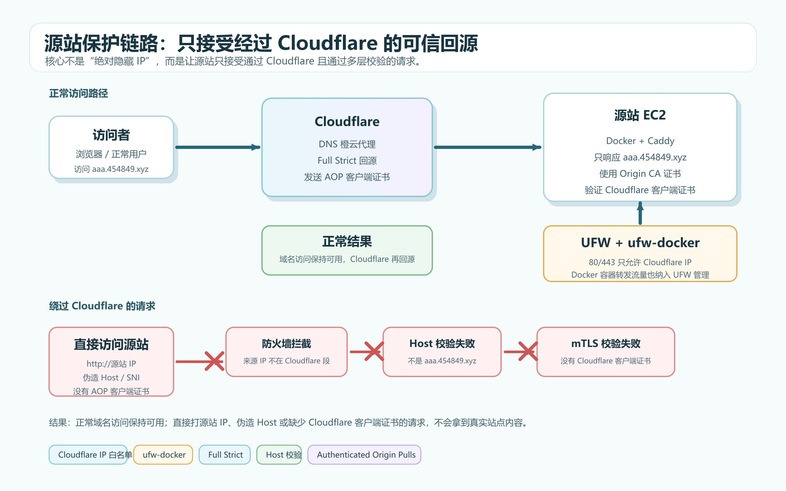
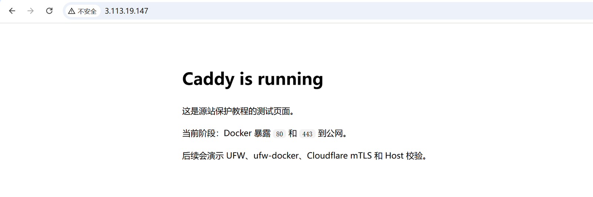
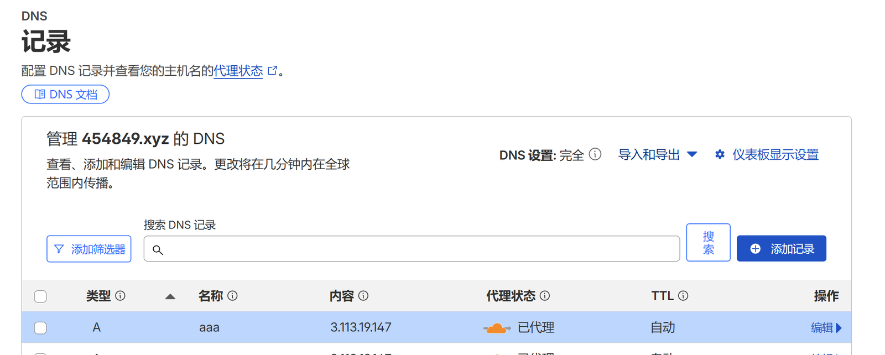
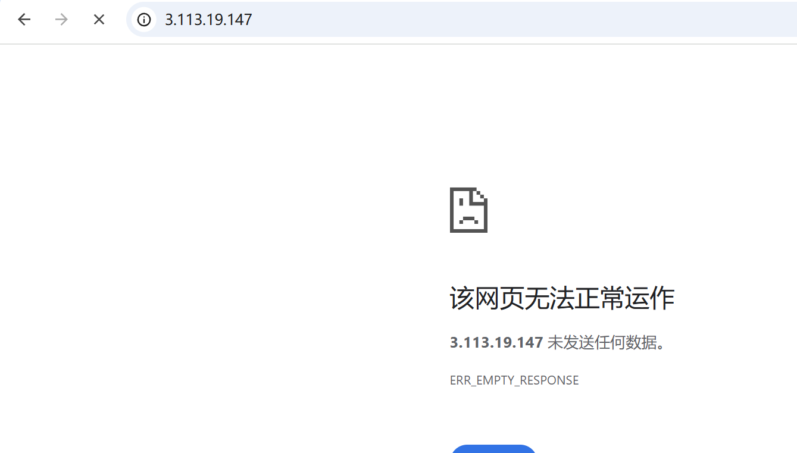
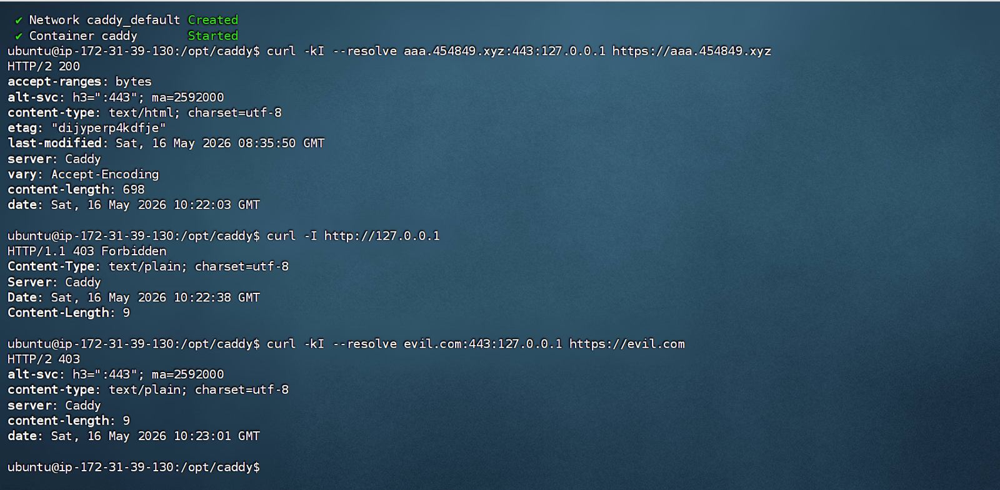
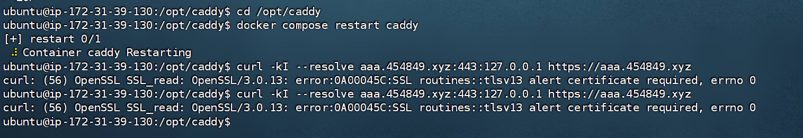
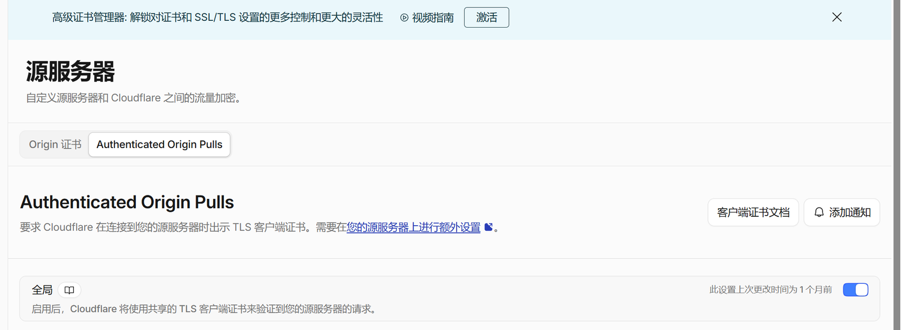

这篇是一次源站保护折腾记录。环境很普通：东京 AWS EC2，Ubuntu 24.04，1C1G，业务主要跑在 Docker 里，入口交给 Cloudflare。

我的目标不是“让源站 IP 永远不泄露”。IP 可能出现在历史解析、扫描记录、日志、误配置里。真正要做的是：即使别人知道源站 IP，也尽量不能绕过 Cloudflare 直接访问网站。

最终思路可以压成一句话：

> 让公网访问只走 Cloudflare，让源站同时校验来源 IP、Host、源站证书和 Cloudflare 客户端证书。

## 整体链路



这套保护大概分成五层：

1. Cloudflare DNS 开橙云，让正常访问先进入 Cloudflare。
2. UFW 只允许 Cloudflare IP 访问源站的 `80/443`。
3. Docker 发布端口后，用 `ufw-docker` 把容器转发流量纳入 UFW。
4. Caddy 使用 Cloudflare Origin CA 证书，Cloudflare SSL/TLS 模式改成 Full Strict。
5. Caddy 严格匹配 Host，并开启 Authenticated Origin Pulls，让源站只接受 Cloudflare 带客户端证书的回源请求。

我这次为了教程演示，AWS 安全组一开始放得比较开，方便对比“保护前”和“保护后”的效果。生产环境不建议这样做，安全组也应该尽量只开放需要的端口，SSH 最好限制为自己的固定 IP。

## 基础环境

服务器上只需要准备几个基础组件：

- `git`：拉取工具或项目。
- `docker` / `docker compose`：跑 Caddy 和后续业务。
- `ufw`：做主机防火墙。
- `fail2ban`：可选。AWS 默认密钥登录时 SSH 爆破风险小一些，但装上也没坏处。

Docker 建议用官方 apt 仓库安装 Docker Engine，不要直接用 Ubuntu 源里的 `docker.io`。这部分按官方文档走就好，文章里不展开完整命令。

这次用 Caddy 做一个最小测试站点。Docker Compose 里只发布 TCP 的 `80` 和 `443`：

```yaml
services:
  caddy:
    image: caddy:2-alpine
    container_name: caddy
    restart: unless-stopped
    ports:
      - "80:80"
      - "443:443"
    volumes:
      - ./Caddyfile:/etc/caddy/Caddyfile:ro
      - ./site:/srv:ro
      - ./certs:/certs:ro
      - caddy_data:/data
      - caddy_config:/config

volumes:
  caddy_data:
  caddy_config:
```

这里我没有发布 `443:443/udp`。Caddy 支持 HTTP/3 时会用到 UDP 443，但如果把 UDP 也暴露出来，防火墙和验证逻辑也要一起处理。为了把教程重点放在源站保护上，我先只保留 TCP。

刚部署完时，直接访问源站 IP 可以看到测试页面：



这就是要解决的问题：只要别人知道源站 IP，就可能绕过 Cloudflare 访问到后面的服务。

## Cloudflare DNS 先接管入口

先把域名的 DNS 解析到 EC2 公网 IP，并开启橙云代理。



这一步只能保证正常用户会先进入 Cloudflare，不代表源站已经安全。因为源站 IP 一旦被发现，别人仍然可以直接请求 `http://源站IP`，或者伪造 Host / SNI 去试探源站。

## UFW 只放行 Cloudflare IP

Cloudflare 官方公开了自己的 IP 段，可以用脚本定期同步到 UFW。因为这次 Caddy 跑在 Docker 里，脚本同时加普通 `allow` 和 Docker 转发用的 `route allow`，把 Cloudflare 来源对宿主机和转发链路的放行一起补上：

```bash
cat << 'EOF' > /root/update_cf_ips.sh
#!/bin/bash
# 专为 ufw-docker 环境设计的 Cloudflare IP 安全更新脚本

CF_V4_URL="https://www.cloudflare.com/ips-v4"
CF_V6_URL="https://www.cloudflare.com/ips-v6"

echo "开始更新 Cloudflare IPv4 规则..."
for ip in $(curl -s $CF_V4_URL); do
    # 允许访问宿主机本身
    ufw allow proto tcp from $ip to any port 80 comment 'CF-HOST'
    ufw allow proto tcp from $ip to any port 443 comment 'CF-HOST'
    # 允许流量转发到 Docker 容器 (ufw-docker 必须)
    ufw route allow proto tcp from $ip to any port 80 comment 'CF-DOCKER'
    ufw route allow proto tcp from $ip to any port 443 comment 'CF-DOCKER'
done

echo "开始更新 Cloudflare IPv6 规则..."
for ip in $(curl -s $CF_V6_URL); do
    ufw allow proto tcp from $ip to any port 80 comment 'CF-HOST'
    ufw allow proto tcp from $ip to any port 443 comment 'CF-HOST'
    ufw route allow proto tcp from $ip to any port 80 comment 'CF-DOCKER'
    ufw route allow proto tcp from $ip to any port 443 comment 'CF-DOCKER'
done

echo "重新加载 UFW..."
ufw reload
echo "更新完成！"
EOF

chmod +x /root/update_cf_ips.sh
(crontab -l 2>/dev/null | grep -v "/root/update_cf_ips.sh"; echo "0 4 * * 1 /bin/bash /root/update_cf_ips.sh >> /var/log/update_cf_ips.log 2>&1") | crontab -
/root/update_cf_ips.sh
```

这段命令会创建 `/root/update_cf_ips.sh`，每周一凌晨 4 点自动执行，并立即手动跑一次。`CF-HOST` 负责宿主机本身的 `80/443`，`CF-DOCKER` 负责把 Cloudflare 来源放行到 Docker 转发链路；脚本只追加规则并 reload，不会重置 UFW，也不会覆盖 `/etc/ufw/after.rules`。这版脚本更偏演示用途，正式长期使用时建议做成幂等更新，再补上错误处理、日志和旧规则清理，避免规则重复堆积、IP 过期后残留，或者脚本失败时悄悄跳过。

> [!WARNING]
> 远程服务器启用 UFW 之前，先确认 SSH 已经放行。最好保留当前 SSH 会话，再开一个新终端测试能否重新登录，避免把自己锁在外面。

到这里看起来已经像是“80/443 只允许 Cloudflare IP”了，但如果服务跑在 Docker 里，还没结束。

## 把 Docker 转发流量纳入 UFW

Docker 发布端口时会改 iptables / NAT 规则。结果是：你在 UFW 里看见 `80/443` 只允许 Cloudflare，但外部直接访问源站 IP 可能仍然能打到容器。

这也是这篇文章里最容易踩坑的地方。解决办法是把 Docker 转发流量也纳入 UFW 管理，我这里用的是 <a href="https://github.com/chaifeng/ufw-docker" target="_blank" rel="noopener noreferrer">ufw-docker</a>。

这里仍然建议先按 `ufw-docker` 官方 README 把 Docker 转发流量接入 UFW，再用它提供的 `check`、`status`、`allow`、`reload` 等命令确认链路已经生效。上面的 `route allow` 只是给 Cloudflare 来源放行，不替代 `ufw-docker` 本身对 Docker 转发规则的接管；Docker 网络、容器名和要暴露的端口在每台机器上都不一样，这部分还是交给 `ufw-docker` 维护更稳妥。

也就是说，Cloudflare IP 脚本维护的是“哪些来源 IP 可以访问源站 `80/443`”；Docker 这一层由 `ufw-docker` 接管。只要你的 IP 更新脚本没有 `ufw reset`，也没有覆盖 `/etc/ufw/after.rules`，一般不会把 `ufw-docker` 的接入配置冲掉。真正需要重新处理的是：你重置了 UFW、手动改了 after rules、或者新增/删除了 Docker 网络。

修复后，再直接访问源站 IP，浏览器应该打不开，或者超时：



这时通过 Cloudflare 域名访问仍然正常，说明防火墙没有误伤正常链路。

## 源站 TLS：Origin CA + Full Strict

下一步是把 Cloudflare 到源站的连接从临时测试状态切到 Full Strict。

Cloudflare Origin CA 的作用是给源站提供一个 Cloudflare 信任的证书。Caddy 使用这张证书，Cloudflare 回源时校验证书有效且主机名匹配。

证书文件放在源站，例如：

```text
/opt/caddy/certs/origin.pem
/opt/caddy/certs/origin.key
```

私钥权限要收紧：

```bash
chmod 600 /opt/caddy/certs/origin.key
chmod 644 /opt/caddy/certs/origin.pem
```

然后 Caddy 只响应自己的正式域名，其他 Host 直接返回 `403`：

```text
http://aaa.454849.xyz {
  redir https://aaa.454849.xyz{uri} 301
}

https://aaa.454849.xyz {
  tls /certs/origin.pem /certs/origin.key
  root * /srv
  file_server
}

:80 {
  respond "Forbidden" 403
}

:443 {
  tls /certs/origin.pem /certs/origin.key
  respond "Forbidden" 403
}
```

Cloudflare 后台里把 SSL/TLS encryption mode 改成 `Full (strict)`。这里不要继续用 `Flexible`，否则 Cloudflare 到源站仍然不是严格 HTTPS 回源，后面的 AOP 也不适合放在这个状态下使用。

Host 校验生效后，直接请求 `127.0.0.1` 或伪造别的域名，会得到 `403`：



这一层解决的是“伪造 Host 访问源站”的问题。它还不是 mTLS，不能证明请求一定来自 Cloudflare。

## 再加一层 mTLS：Authenticated Origin Pulls

Cloudflare 的 Authenticated Origin Pulls，简称 AOP，可以让 Cloudflare 回源时带上客户端证书。源站 Caddy 再验证这个客户端证书，验证不通过就直接在 TLS 阶段拒绝。

这里有两个证书概念，别混在一起：

- Origin CA 证书：装在源站上，给 Cloudflare 校验证源站身份。
- AOP 客户端证书：由 Cloudflare 回源时提供，给源站校验“这次请求来自 Cloudflare”。

先下载 Cloudflare Global AOP CA 证书：

```bash
curl -fsSL https://developers.cloudflare.com/ssl/static/authenticated_origin_pull_ca.pem \
  -o /opt/caddy/certs/cloudflare-origin-pull-ca.pem
```

然后把 Caddy 的 TLS 配置改成要求客户端证书：

```text
(origin_tls) {
  tls /certs/origin.pem /certs/origin.key {
    client_auth {
      mode require_and_verify
      trust_pool file /certs/cloudflare-origin-pull-ca.pem
    }
  }
}

http://aaa.454849.xyz {
  redir https://aaa.454849.xyz{uri} 301
}

https://aaa.454849.xyz {
  import origin_tls
  root * /srv
  file_server
}

:80 {
  respond "Forbidden" 403
}

:443 {
  import origin_tls
  respond "Forbidden" 403
}
```

重启 Caddy 后，先不要急着开 Cloudflare 后台。直接从源站本机模拟访问，应该失败：

```bash
curl -kI --resolve aaa.454849.xyz:443:127.0.0.1 https://aaa.454849.xyz
```

如果看到类似 `tlsv13 alert certificate required`，说明 Caddy 已经在要求客户端证书。



最后到 Cloudflare 后台开启 Global Authenticated Origin Pulls：



开启后，正常域名访问依然走 Cloudflare，Cloudflare 带客户端证书回源，所以可以访问；直接打源站 IP 或本地伪造解析，因为没有 Cloudflare 客户端证书，会在 TLS 阶段失败。

> [!NOTE]
> Global AOP 用的是 Cloudflare 共享客户端证书，它证明“请求来自 Cloudflare 网络”，不是证明“请求来自我的这个 Cloudflare zone”。不过普通套餐下，别人通常不能随意指定回源端口、改写 Host/SNI 再打到你的源站；这类更强的回源改写能力一般需要 Enterprise 或更高权限配置。对个人站来说，Global AOP + 严格 Host 校验 + Cloudflare IP 白名单已经够用了。

## 验证清单

我最后按这个顺序检查：

1. `https://aaa.454849.xyz` 正常打开。
2. `http://aaa.454849.xyz` 会跳转到 HTTPS。
3. `http://源站IP` 无法直接打开。
4. 伪造 Host 请求源站，不会返回真实站点内容。
5. 没有 Cloudflare 客户端证书时，直接打源站 HTTPS 会失败。
6. UFW 里能看到 Cloudflare IP 白名单，`ufw-docker` 也能确认 Docker 转发流量已经接入 UFW。
7. 自动更新 Cloudflare IP 的定时任务正常运行。

验证时不要只看“能不能访问域名”。源站保护最重要的是反向测试：绕过 Cloudflare 的路径是不是被挡住了。

## 限制和取舍

这套方案不是万能的。

首先，Cloudflare IP 白名单依赖 IP 段同步，脚本要能稳定更新。如果脚本只是追加 Cloudflare allow 规则并 `ufw reload`，通常不会影响 `ufw-docker`；如果脚本用了 `ufw reset`，或者覆盖了 `/etc/ufw/after.rules`，才需要把 SSH、Cloudflare 主机规则和 `ufw-docker` 接入配置一起恢复回来。本文里的脚本偏演示思路，生产环境更建议做成幂等更新：更新前清理旧 Cloudflare 规则，避免长期运行后堆积重复或过期项。

其次，Global AOP 仍然是共享信任。它适合个人站和普通项目，因为普通 Cloudflare 配置下，攻击者很难同时做到“让 Cloudflare 回源到你的 IP、伪造正确 Host/SNI、并绕过你的源站校验”。如果你的安全模型要求“只有我这个 zone 可以访问源站”，再考虑自定义 AOP。

另外，教程里的 AWS 安全组开放是为了演示对比。正式服务器不要这样配置。安全组、系统防火墙、Caddy Host 校验、mTLS 都是不同层的保护，能叠加就叠加。

最后，实际部署时通常让 Caddy 作为唯一公网入口，绑定宿主机的 `80/443` 就够了。其它业务容器不需要直接绑定宿主机公网端口，可以只监听本机或 Docker 内网，再由 Caddy 反向代理过去。即使已有服务绑定了宿主机端口，也要用 UFW / ufw-docker 管住入口，不要让它绕过 Cloudflare 暴露在公网。

## 参考资料

- <a href="https://developers.cloudflare.com/fundamentals/concepts/cloudflare-ip-addresses/" target="_blank" rel="noopener noreferrer">Cloudflare IP ranges</a>
- <a href="https://developers.cloudflare.com/ssl/origin-configuration/ssl-modes/full-strict/" target="_blank" rel="noopener noreferrer">Cloudflare Full (strict) SSL/TLS mode</a>
- <a href="https://developers.cloudflare.com/ssl/origin-configuration/authenticated-origin-pull/" target="_blank" rel="noopener noreferrer">Cloudflare Authenticated Origin Pulls</a>
- <a href="https://docs.docker.com/engine/install/ubuntu/" target="_blank" rel="noopener noreferrer">Docker Engine on Ubuntu</a>
- <a href="https://caddyserver.com/docs/caddyfile/directives/tls" target="_blank" rel="noopener noreferrer">Caddy TLS directive</a>
- <a href="https://github.com/chaifeng/ufw-docker" target="_blank" rel="noopener noreferrer">ufw-docker</a>
