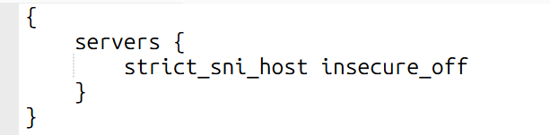

这篇记录一下用 Cloudflare 单域名 SaaS + CNAME 给普通网站做优选的过程。

先说结论：这套东西对电信比较明显。移动还是算了，我这边测出来依然很拉。联通的国际出口带宽大，虽然延迟高一点，但不怎么丢包，其实可以不优选。

优选域名我用的是 <a href="https://cf.090227.xyz" target="_blank" rel="noopener noreferrer">cf.090227.xyz</a> 里挑出来的结果。IP 和域名都不打码，反正这篇就是折腾记录。

## 原理先说一下

单域名加速的核心思路是：让用户访问 `bot1.starshadow.cc`，这条记录先 CNAME 到一个优选域名，再由 Cloudflare for SaaS 的自定义主机名把请求转回自己的源站。

听起来绕了一圈，但目的很简单：正常访问还是走 Cloudflare，只是入口不直接用 Cloudflare 默认分配的边缘节点，而是借 CNAME 指到一个更适合当前线路的节点。

这里最麻烦的地方是单域名。

Cloudflare for SaaS 在默认回退源和自定义源服务器之间，对 `SNI` 和 `Host` 的处理不一样。单域名配置时很容易出现 `SNI` 和 `Host` 不一致。Caddy 默认会校验这个东西，于是后面会遇到 `1000` 和 `421`。

## 我的环境

我的 Cloudflare 配置是：

- Cloudflare 强制 HTTPS 已开启。
- 源站自己没有直接开公网 HTTPS 入口给用户访问。
- SSL/TLS 模式是 `Full (strict)`。
- Caddy 已经配置好相关域名。

我这里有两个域名：

- `bot.starshadow.cc`：正常黄云，直接回源。
- `bot1.starshadow.cc`：准备走优选。

后端都是同一个服务，Caddy 里大概是这样：

```text
bot.starshadow.cc {
  import cf_mtls_cc
  reverse_proxy astrbot:6185
}

bot1.starshadow.cc {
  import cf_mtls_cc
  reverse_proxy astrbot:6185
}
```


## 配置 SaaS 回源记录

先配置 SaaS 回源记录。比如我这里让 `saas.starshadow.cc` 指向自己的服务器 IP。


然后到 Cloudflare for SaaS 里添加回退源。


这里有个坑：单域名方案里，SaaS 回退源基本不是拿来直接回源用的。

如果把它当成真正的默认回退源，后面会触发 `1000`。所以它更像是为了让后面的“自定义主机名”和“自定义源服务器”配置能走下去。回退源指向别的 IP 也可以，别指望它在单域名里解决所有问题。

## 添加 DNS 记录

DNS 里需要加两条 `CNAME` 和一条源站记录。


我的链路是：

- `bot1.starshadow.cc` 指向 `cdn.starshadow.cc`。
- `cdn.starshadow.cc` 指向选好的优选域名。
- `bot.starshadow.cc` 直接指向源站，保持黄云。

优选域名可以自己在 `cf.090227.xyz` 里挑。不同地区结果差很多，别只看一个测速点。

## 自定义主机名和 1000 错误

接着添加自定义主机名。

如果这里选择“默认回退源”，也就是前面那个指向源站的 `saas.starshadow.cc`，看起来配置能保存，但实际访问会触发 `1000`。


访问时就是这个样子：


所以单域名这里不要死磕默认回退源。它在这个场景下没什么用。

## 自定义源服务器和 421 错误

下一步改成“自定义源服务器”，我这里填 `bot.starshadow.cc`。


这时又会遇到另一个问题：`421`。


原因在 `SNI` 和 `Host`。

如果选择默认回退源，Cloudflare 会帮你把 `SNI` 和 `Host` 都重写成 `bot1.starshadow.cc`。但使用自定义源服务器后，它不会这么处理。

这时请求大概会变成：

- `Host`: `bot1.starshadow.cc`
- `SNI`: `bot.starshadow.cc`

Caddy 校验不通过，于是直接返回 `421`。这个报错一开始看着挺烦，因为 DNS、SaaS、自定义主机名都像是配置好了，结果还是打不开。

## 关闭 Caddy 的 SNI/Host 校验

我这里的解决办法是关闭 Caddy 的 `SNI` 和 `Host` 严格校验：

```text
servers {
  strict_sni_host insecure_off
}
```



这个名字已经把风险写脸上了：`insecure_off`。

它能解决单域名下 `SNI` 和 `Host` 不一致的问题，但确实不是最漂亮的方案。如果你更在意安全边界，双域名会更干净一点。单域名能跑通，代价就是这里要放松 Caddy 的校验。

重启 Caddy 后，再访问 `bot1.starshadow.cc`，页面就能正常打开了。


## 优选前后对比

下面是电信线路的对比。

我这边电信优选效果比较明显，丢包和延迟都好看很多。


不优选时就比较难看。


网站测速也能看出来差异。


移动这边我测下来还是不太行，优选了也没救回来多少。联通反而不用太折腾，延迟虽然高，但不怎么丢包。

所以这套方案更适合电信线路明显抽风、又想继续用 Cloudflare 的情况。要是你本地线路本来就稳，可能折腾完也没什么惊喜。
