这篇记录一下用 Cloudflare SaaS + CNAME 给普通网站做优选的过程。

前半部分是单域名方案，能跑，但要处理 `SNI` 和 `Host` 不一致的问题。后半部分是双域名方案，DNS 数量差不多，只是把入口和回源拆得更清楚，也不用为了跑通去放松 Caddy 的校验。

先说结论：这套东西对电信比较明显。移动还是算了，我这边测出来依然很拉。联通的国际出口带宽大，虽然延迟高一点，但不怎么丢包，其实可以不优选。

优选入口我用的是 <a href="https://cf.090227.xyz" target="_blank" rel="noopener noreferrer">cf.090227.xyz</a> 提供的域名。不是在里面挑一个 IP，而是把 CNAME 指到它的优选入口，比如 `youxuan.cf.090227.xyz`，就能走它那边的优选效果。

## 原理先说一下

单域名加速的核心思路是：让用户访问 `bot1.starshadow.cc`，先让 `bot1.starshadow.cc` CNAME 到 `cdn.starshadow.cc`，再让 `cdn.starshadow.cc` CNAME 到 `youxuan.cf.090227.xyz` 这类优选入口。请求进入 Cloudflare 后，再由 Cloudflare for SaaS 的自定义主机名把它转回自己的源站。

听起来绕了一圈，但目的很简单：正常访问还是走 Cloudflare，只是入口不直接用 Cloudflare 默认分配的边缘节点，而是借 CNAME 指到一个更适合当前线路的节点。

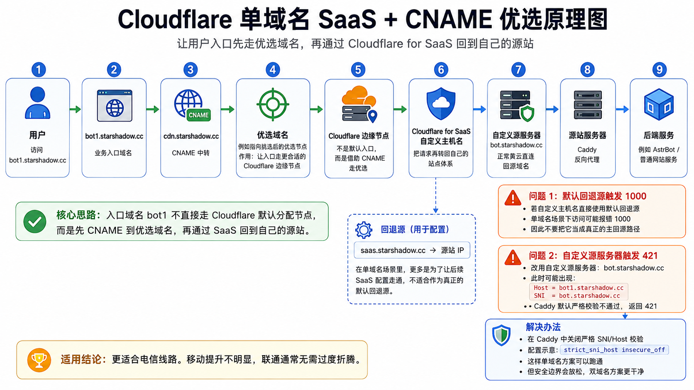

单域名里最麻烦的地方是 `SNI` 和 `Host`。

Cloudflare for SaaS 在默认回退源和自定义源服务器之间，对 `SNI` 和 `Host` 的处理不一样。单域名配置时很容易出现 `SNI` 和 `Host` 不一致。Caddy 默认会校验这个东西，于是后面会遇到 `1000` 和 `421`。

双域名方案的思路是把入口和回源拆开。主域名 CNAME 到辅助入口域名，辅助入口域名再 CNAME 到优选入口；回源用另一个辅助记录指向源站，并把它作为 SaaS 回退源。这样走默认回源时，Cloudflare 会处理 `SNI` 和 `Host`，Caddy 可以继续严格校验。

## 我的环境

我的 Cloudflare 配置是：

- Cloudflare 强制 HTTPS 已开启。
- 源站自己没有直接开公网 HTTPS 入口给用户访问。
- SSL/TLS 模式是 `Full (strict)`。
- Caddy 已经配置好相关域名。

我这里有两个域名：

- `bot.starshadow.cc`：正常黄云，直接回源。
- `bot1.starshadow.cc`：准备走优选。

后端都是同一个服务，Caddy 里配置了这两个域名。

这里截图里的 `reverse_proxy astrbot:6185` 只是我的 AstrBot 容器地址，不是通用配置。实际使用时要换成你自己的服务地址，不要照抄。

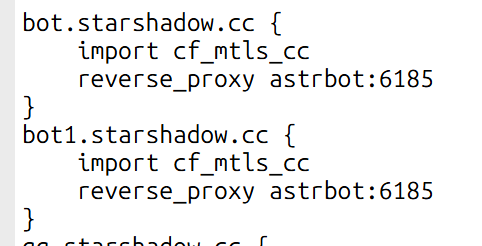

## 配置 SaaS 回源记录

先配置 SaaS 回源记录。比如我这里让 `saas.starshadow.cc` 指向自己的服务器 IP。

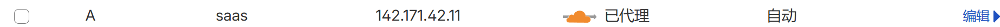

然后到 Cloudflare for SaaS 里添加回退源。

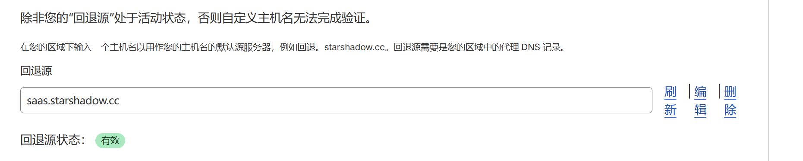

这里有个坑：单域名方案里，SaaS 回退源基本不是拿来直接回源用的。

如果把它当成真正的默认回退源，后面会触发 `1000`。所以它更像是为了让后面的“自定义主机名”和“自定义源服务器”配置能走下去。回退源指向别的 IP 也可以，别指望它在单域名里解决所有问题。

## 添加 DNS 记录

DNS 里需要加两条 `CNAME` 和一条源站记录。

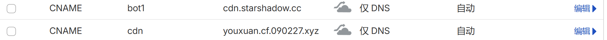

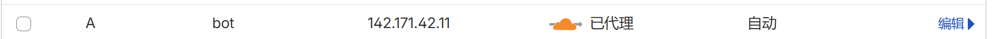

我的链路是：

- `bot1.starshadow.cc` 指向 `cdn.starshadow.cc`。
- `cdn.starshadow.cc` 指向 `youxuan.cf.090227.xyz`。
- `bot.starshadow.cc` 直接指向源站，保持黄云。

也就是说，这里有两条 `CNAME`：业务入口先到自己的 `cdn` 中转记录，`cdn` 再到 `cf.090227.xyz` 提供的优选入口。


## 自定义主机名和 1000 错误

接着添加自定义主机名。

如果这里选择“默认回退源”，也就是前面那个指向源站的 `saas.starshadow.cc`，看起来配置能保存，但实际访问会触发 `1000`。

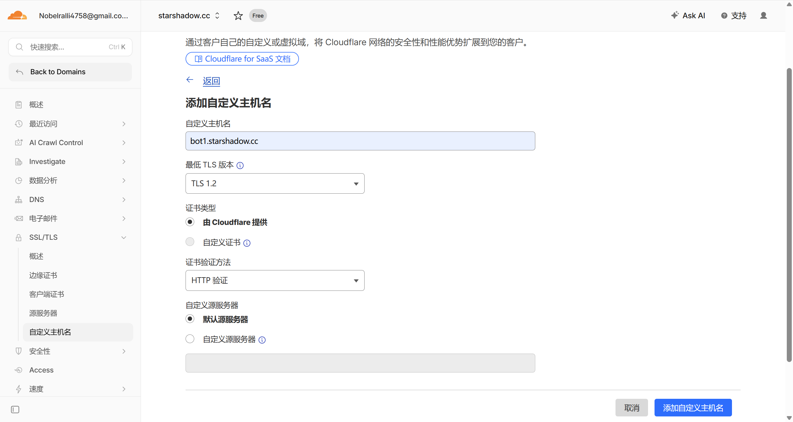

访问时就是这个样子：

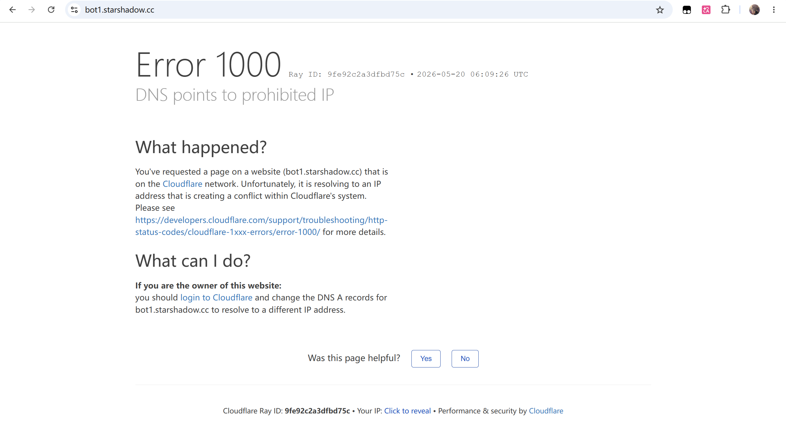

所以单域名这里不要死磕默认回退源。它在这个场景下没什么用。

## 自定义源服务器和 421 错误

下一步改成“自定义源服务器”，我这里填 `bot.starshadow.cc`。

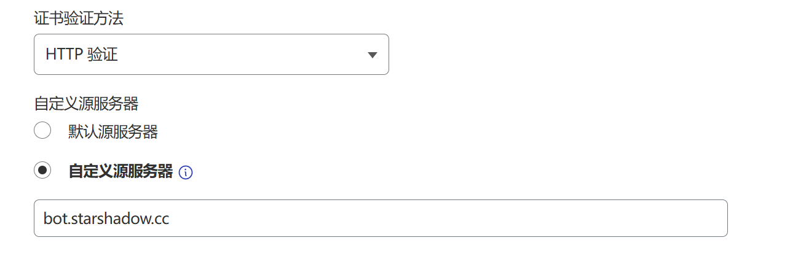

这时又会遇到另一个问题：`421`。

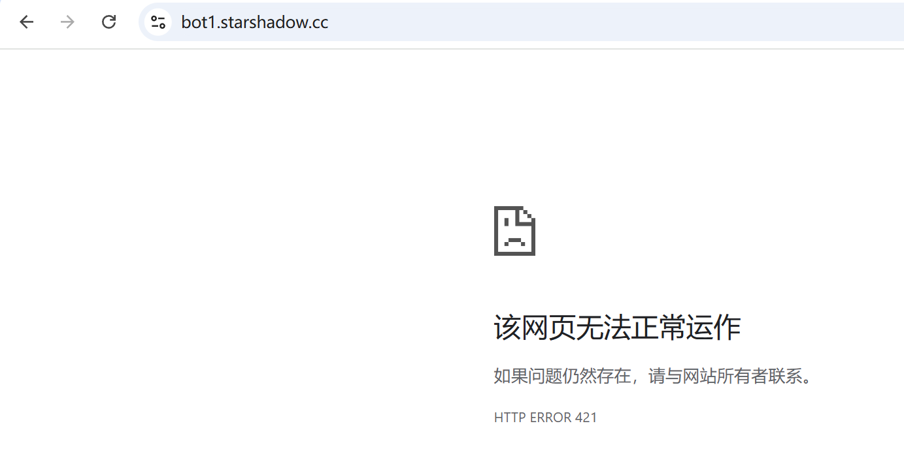

原因在 `SNI` 和 `Host`。

如果选择默认回退源，Cloudflare 会帮你把 `SNI` 和 `Host` 都重写成 `bot1.starshadow.cc`。但使用自定义源服务器后，它不会这么处理。

这时请求大概会变成：

- `Host`: `bot1.starshadow.cc`
- `SNI`: `bot.starshadow.cc`

Caddy 校验不通过，于是直接返回 `421`。这个报错一开始看着挺烦，因为 DNS、SaaS、自定义主机名都像是配置好了，结果还是打不开。

## 关闭 Caddy 的 SNI/Host 校验

我这里的解决办法是关闭 Caddy 的 `SNI` 和 `Host` 严格校验：

```text
{
  servers {
    strict_sni_host insecure_off
  }
}
```

这个名字已经把风险写脸上了：`insecure_off`。

它能解决单域名下 `SNI` 和 `Host` 不一致的问题，但确实不是最漂亮的方案。如果你更在意安全边界，双域名会更干净一点。单域名能跑通，代价就是这里要放松 Caddy 的校验。

重启 Caddy 后，再访问 `bot1.starshadow.cc`，页面就能正常打开了。

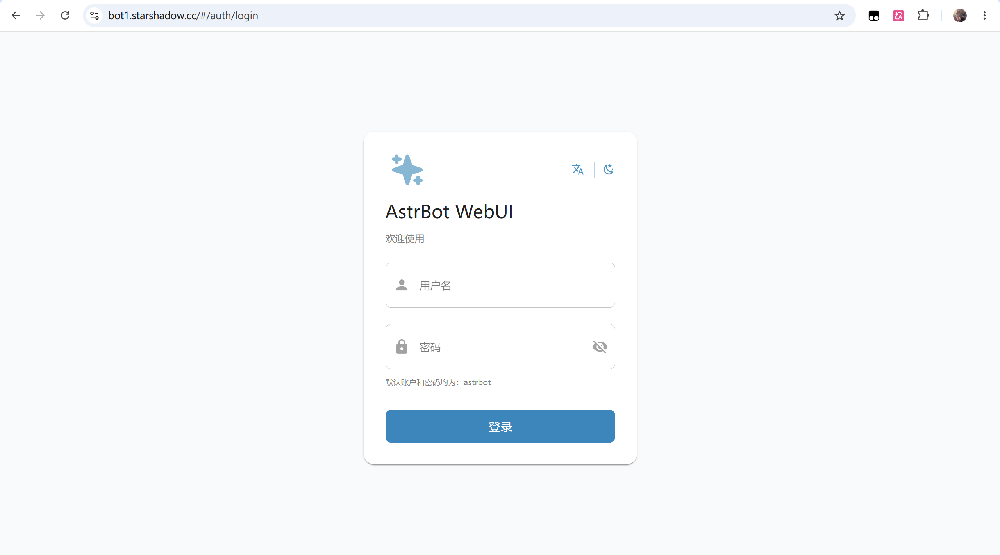

这就是单域名方案。适合先验证思路，或者手头确实只想用一个域名折腾。但如果能接受多一组辅助域名，我更建议用下面的双域名方案。

## 双域名方案：让 SNI 和 Host 对齐

双域名方案不用关闭 Caddy 的 `SNI/Host` 校验。

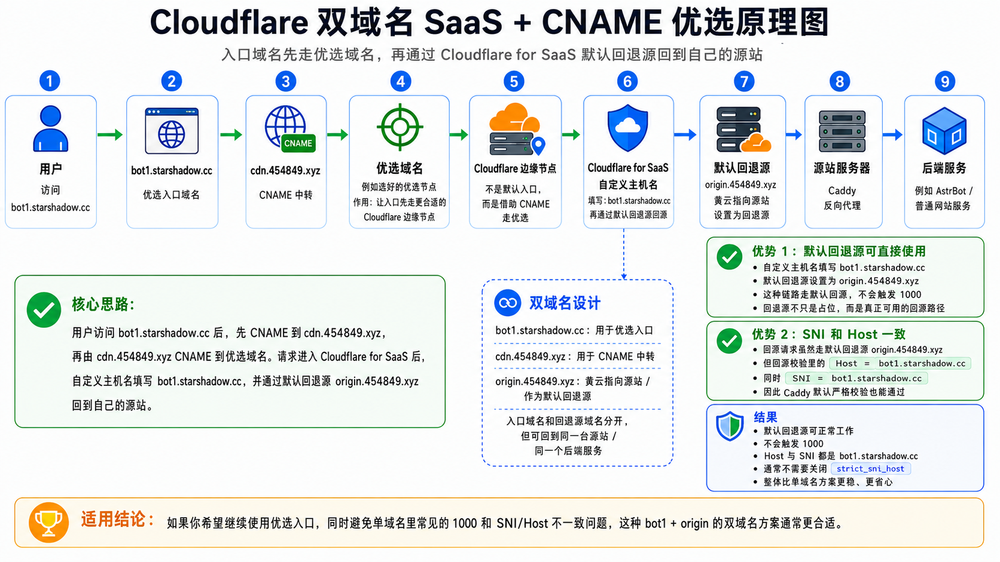

先删掉原本给主域名配置的 SaaS 回源和自定义主机名，避免旧配置混在一起。主域名本身不需要再做 SaaS 回源记录。

我这里改成了这条链路：

- `bot1.starshadow.cc` CNAME 到 `cdn.454849.xyz`。
- `cdn.454849.xyz` 再 CNAME 到 `youxuan.cf.090227.xyz`。
- `origin.454849.xyz` 指向源站 IP，作为 SaaS 回退源。
- 自定义主机名仍然添加 `bot1.starshadow.cc`，回源方式选择默认回源。

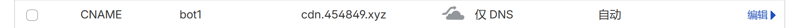


然后把 `origin.454849.xyz` 设置成回退源，再添加 `bot1.starshadow.cc` 这个自定义主机名。

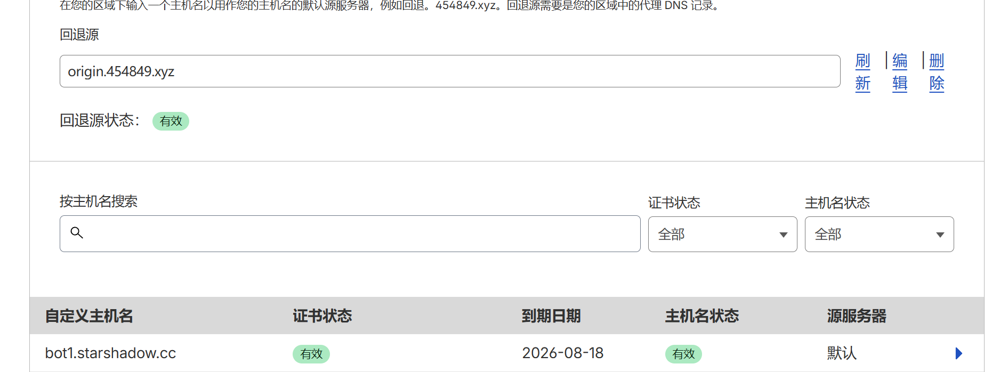

这时不用再指定自定义源服务器，选择默认回源就行。Cloudflare 会把 `SNI` 和 `Host` 处理到一致，Caddy 那边可以继续严格校验。

Caddy 只要用了 TLS，默认就会做这类校验。我本地额外写 `strict_sni_host on` 只是为了演示它处在严格校验状态，不是每个人都必须加这一段。

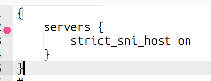

重启 Caddy 后访问 `bot1.starshadow.cc`，页面可以正常打开。

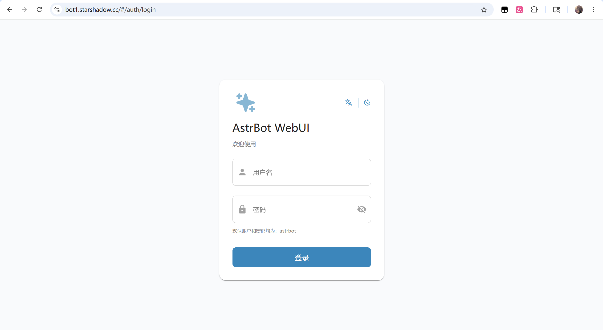

## 优选前后对比

下面是电信线路的对比。

我这边电信优选效果比较明显，丢包和延迟都好看很多。

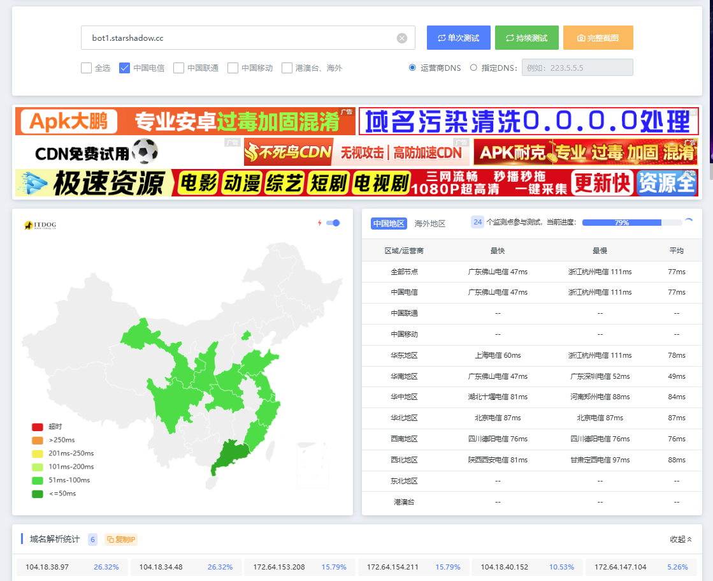

不优选时就比较难看。

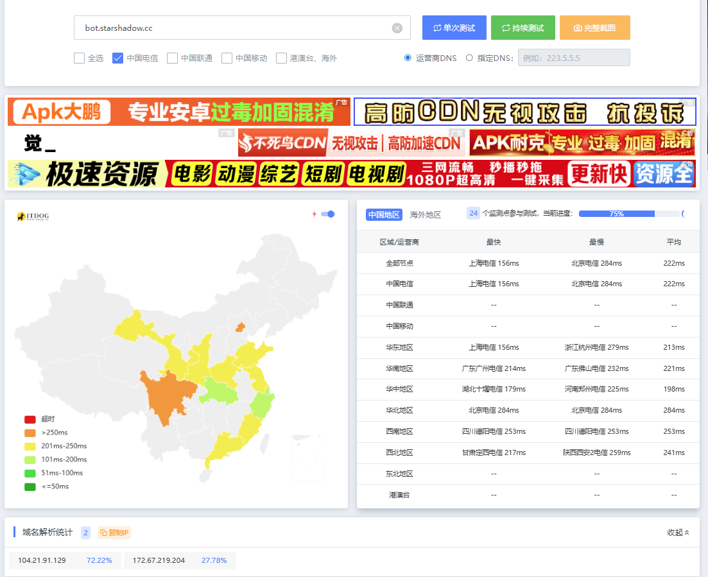

网站测速也能看出来差异。

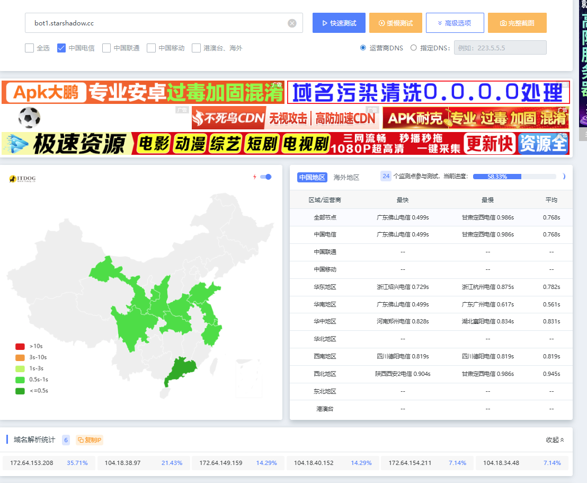

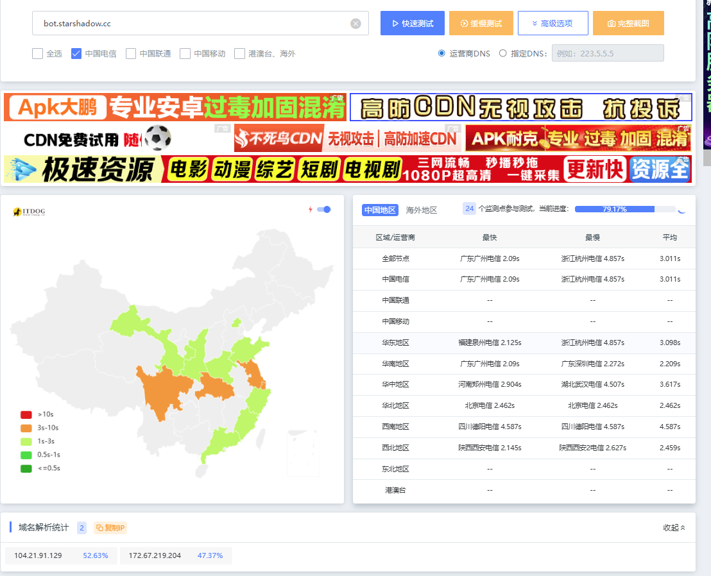

双域名方案跑通后，我也测了一次，结果同样正常。

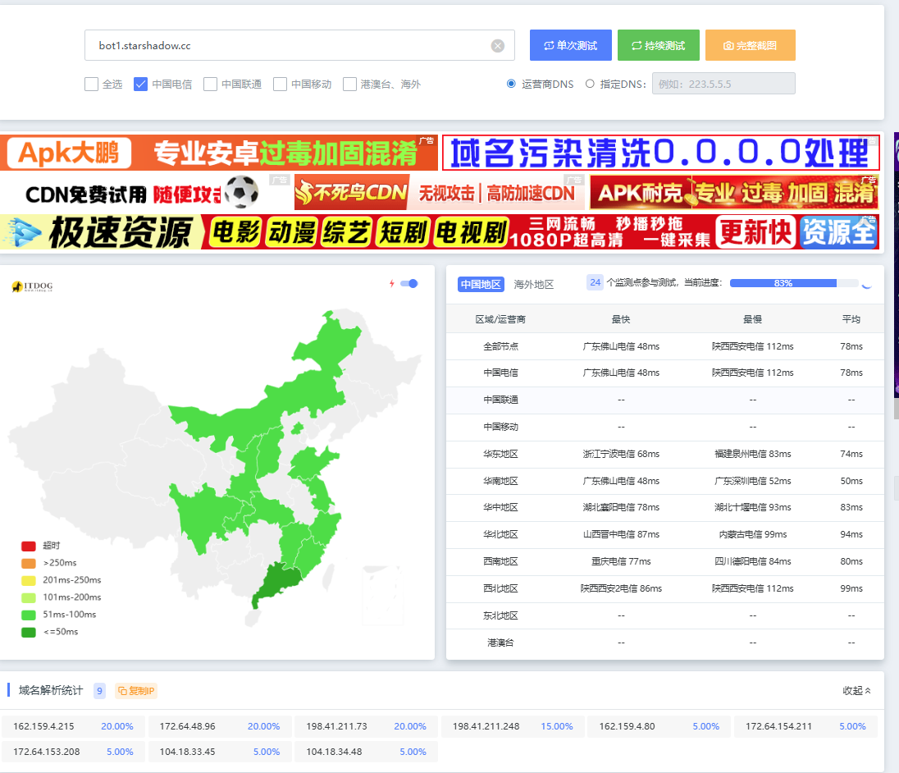

移动这边我测下来还是不太行，优选了也没救回来多少。联通反而不用太折腾，延迟虽然高，但不怎么丢包。

所以这套方案更适合电信线路明显抽风、又想继续用 Cloudflare 的情况。要是你本地线路本来就稳，可能折腾完也没什么惊喜。

如果只看后续维护，我现在更倾向双域名。单域名能跑，但要接受 Caddy 校验放松；双域名的 DNS 数量其实差不多，只是把入口域名和回源域名分开了，`SNI` 和 `Host` 能对齐，也更好理解。
