这篇继续记录 Cloudflare 优选入口的折腾过程。

前面写普通网站时，核心思路是用 Cloudflare for SaaS 的自定义主机名承接业务域名，再把业务域名通过 `CNAME` 指到一个优选入口。请求先进 Cloudflare，再由 SaaS 配置把流量转回真正的服务。

这次换几个更常见的 Cloudflare 产品来试：Tunnel、Workers / Pages，以及 R2。它们的共同点是入口本来就在 Cloudflare 上，所以不需要像传统源站那样考虑服务器 IP 暴露；要处理的是“用户访问的域名怎么先进优选入口，再回到真正的 Cloudflare 服务”。

> [!NOTE]
> 文中的 `454849.xyz`、`starshadow.cc` 和 `youxuan.cf.090227.xyz` 都是我的测试环境。实际使用时换成自己的域名和优选入口，不要照抄。

## 原理先说一下

这套做法可以拆成三段：

1. 用户访问一个业务域名，比如 `file1.454849.xyz`。
2. 这个业务域名不直接走默认解析，而是 `CNAME` 到 `cdn.454849.xyz`，再由 `cdn` 指向优选入口。
3. Cloudflare 收到请求后，通过自定义主机名、回退源或规则配置，把流量送回真正的 Tunnel、Workers 或 R2。

所以它不是“给 Cloudflare 服务换源站”，而是“给访问入口换线路”。能不能变快，取决于你本地运营商到这个优选入口的质量。电信线路通常更容易看到差异，移动和联通不一定有明显收益。

## Tunnel 优选

Tunnel 场景里，我用的是 File Browser。这里需要两个主机名：

- `file.454849.xyz`：回源用，继续绑定到 Cloudflare Tunnel。
- `file1.454849.xyz`：用户访问用，准备走优选入口。

在 Zero Trust 的 Tunnel 配置里，先给同一个服务创建两条 Public Hostname 路由。两条路由都指向同一个内网服务，例如 `http://filebrowser:80`。

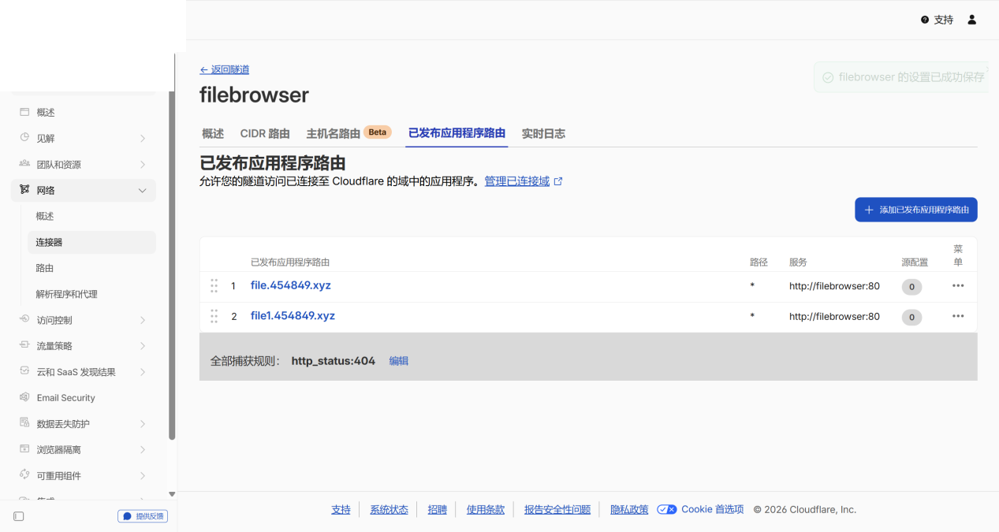

回到 DNS 后，先看原本的 Tunnel 解析。默认情况下，`file` 会是 Cloudflare 自动生成的隧道记录。

接着把用户访问域名 `file1` 改成 `CNAME`，指到自己的中转记录 `cdn.454849.xyz`。这个记录保持“仅 DNS”。

然后让 `cdn` 再 `CNAME` 到优选入口。这里我用的是 `youxuan.cf.090227.xyz`，你也可以换成自己的优选入口。

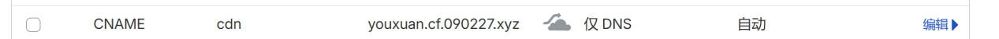

还需要准备一个回退源记录。单域名方案里，默认回退源在这个场景下并不是真正拿来承接业务流量的，主要是为了让自定义主机名验证和配置能继续走下去。我的测试里用 `origin.454849.xyz` 指向一个可被 Cloudflare 代理的记录。

然后到 Cloudflare for SaaS 里添加回退源，填入 `origin.454849.xyz`。等状态变成有效以后，再继续添加自定义主机名。

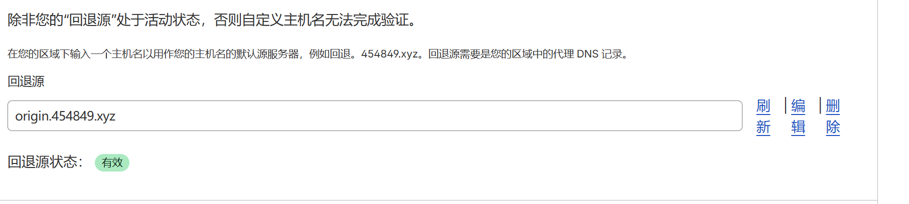

添加自定义主机名时，主机名填用户访问域名 `file1.454849.xyz`，源服务器填真正的 Tunnel 域名 `file.454849.xyz`。这样外面访问的是 `file1`，回到服务时走的是 `file`。

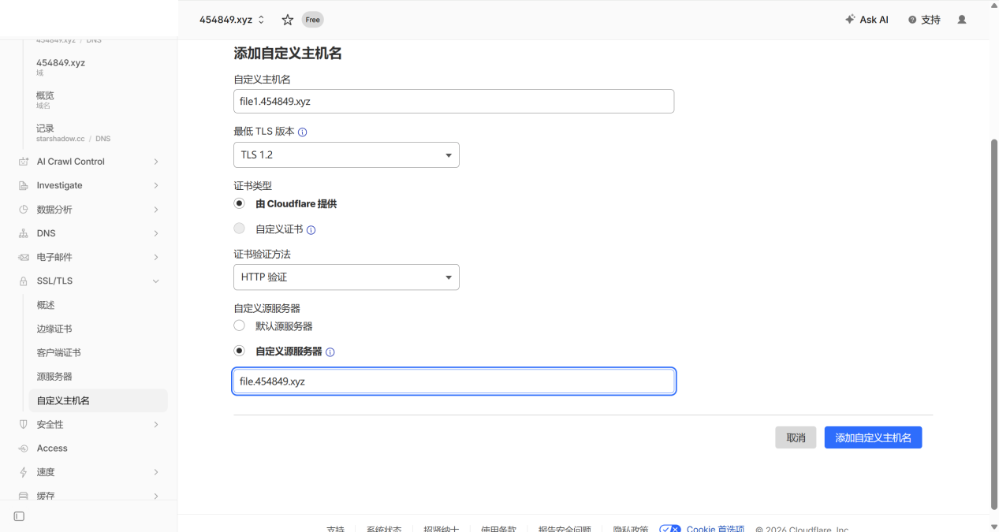

等证书和主机名验证完成后，访问 `file1.454849.xyz` 就能打开 File Browser。

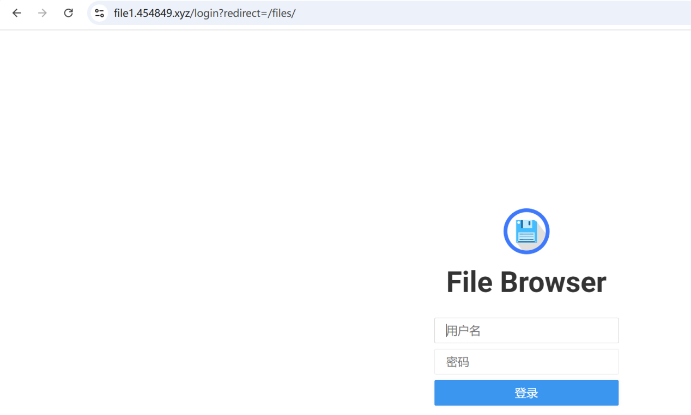

我这边用站长工具测了一下。走优选入口时，整体延迟明显好看一些。

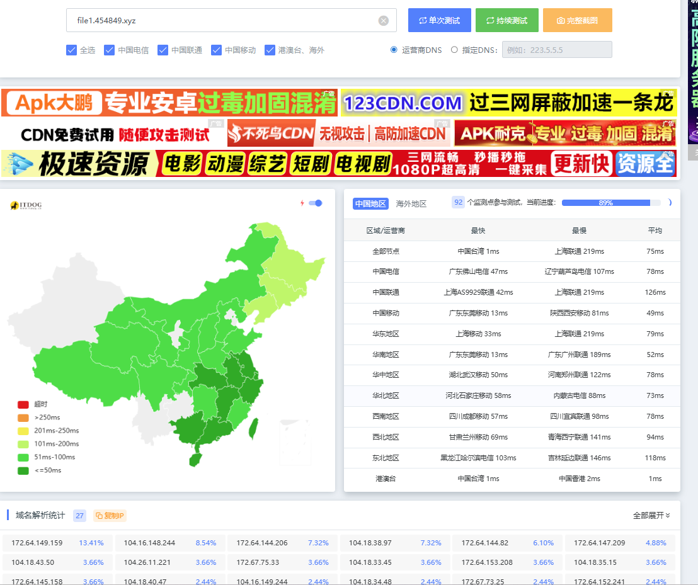

不走优选时，同一类测试会更慢一些。

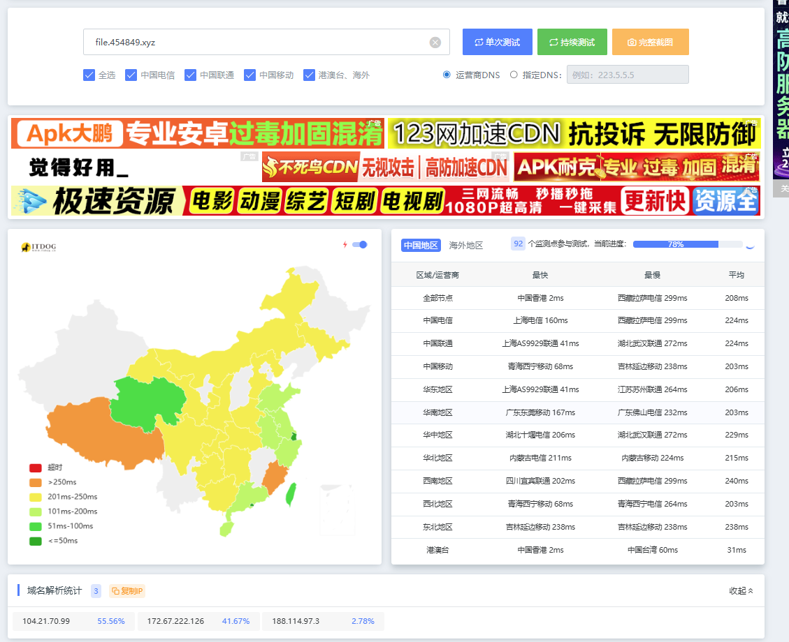

## Workers / Pages 优选

Workers 的入口本来就在 Cloudflare 上，通常可以通过 Route 或 Custom Domain 绑定域名。Cloudflare 官方文档里也把 Workers 的流量接入分成路由、自定义域名等方式。这里的思路是：先让 Workers 接住一个正常域名，再把用户访问域名通过 `CNAME` 引到优选入口。

我的博客这里已经有 Workers 路由，匹配的是 `blog.starshadow.cc/*`。

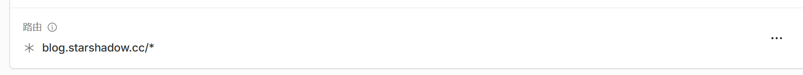

DNS 里让 `blog` 指向自己的中转域名 `cdn.starshadow.cc`。

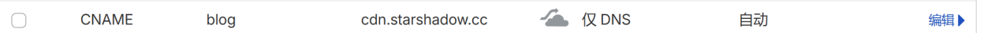

再让 `cdn` 指向优选入口。

如果你的站点还在 Cloudflare Pages 上，也可以先评估迁到 Workers Static Assets。Cloudflare 现在已经给了从 Pages 迁到 Workers 的官方说明。迁完以后，入口管理会更接近 Workers，后续做路由和优选也更顺手。

> [!NOTE]
> Workers / Pages 这段不要只看 DNS 是否保存成功。最终要确认的是：访问业务域名时，确实命中了对应 Worker 或静态站点，而不是被中转域名、SaaS 配置或旧 DNS 记录带偏。

## R2 优选

R2 的场景稍微绕一点。官方支持给公开 Bucket 绑定自定义域名，所以第一步还是先让 R2 有一个正常可访问的自定义域名。

我这里先给 R2 绑定了 `r2.454849.xyz`。

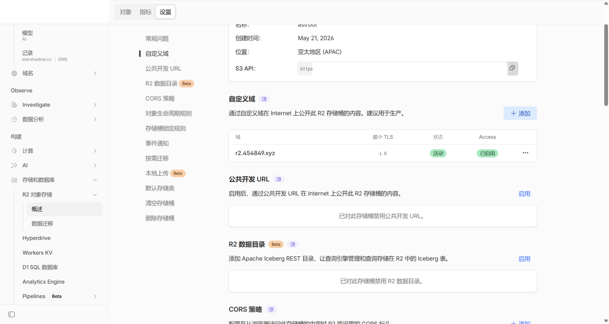

然后到规则里使用 Cloud Connector，选择 Cloudflare R2 作为目标。

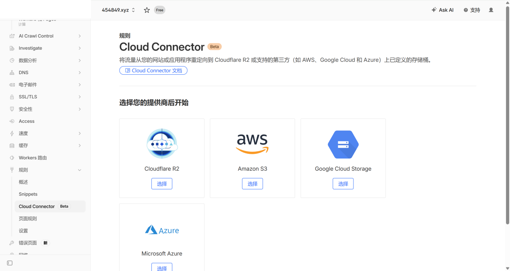

选择要转发到的 R2 存储桶，并选择刚才绑定过的 R2 自定义域名。

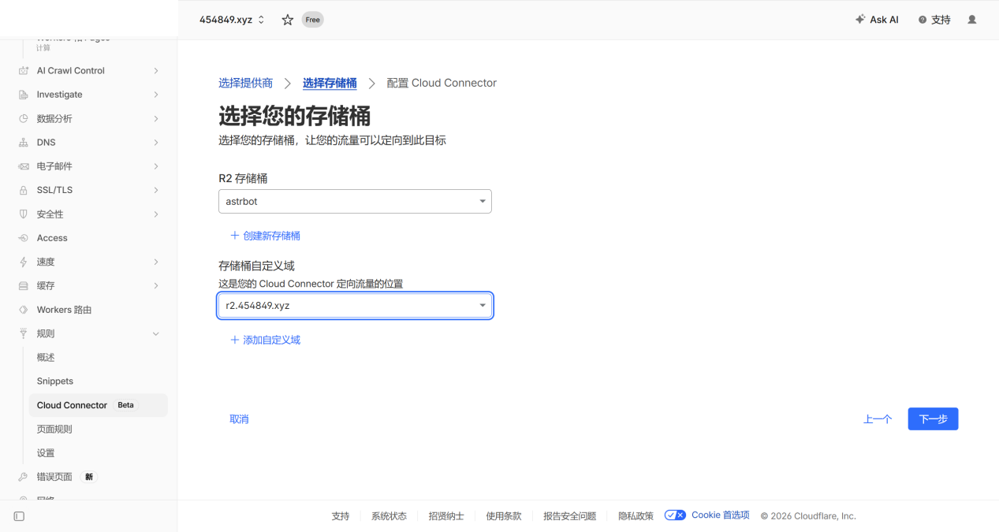

接着配置匹配条件。我的测试里用 `youxuanr2.454849.xyz` 作为准备走优选的入口域名。

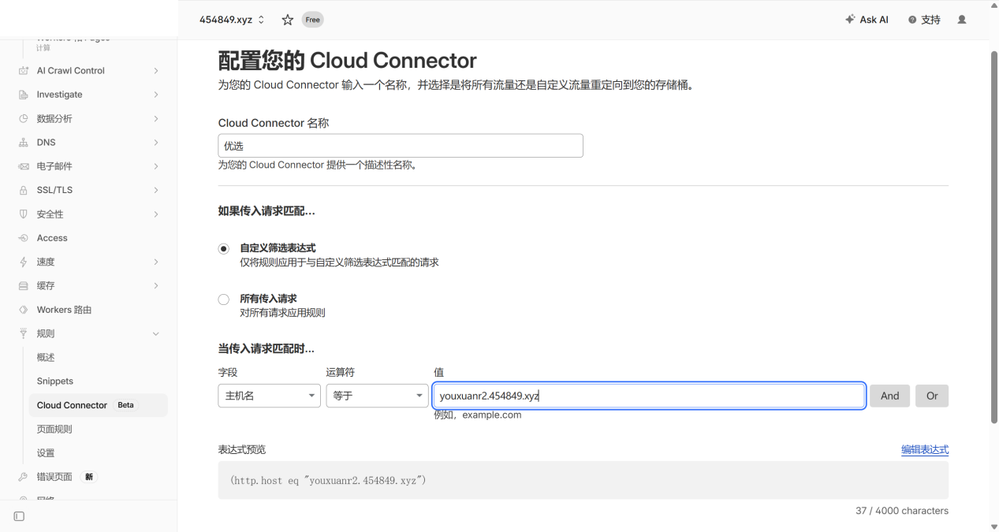

DNS 里再加两条 `CNAME`：

- `youxuanr2.454849.xyz` 指向 `cdn.454849.xyz`。
- `cdn.454849.xyz` 指向优选入口。

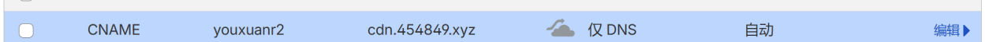

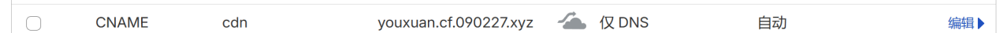

如果直接访问根路径，可能会看到 R2 的 `Object not found`，这不一定代表优选失败。R2 访问的是对象路径，根路径没有对象时返回 404 很正常。

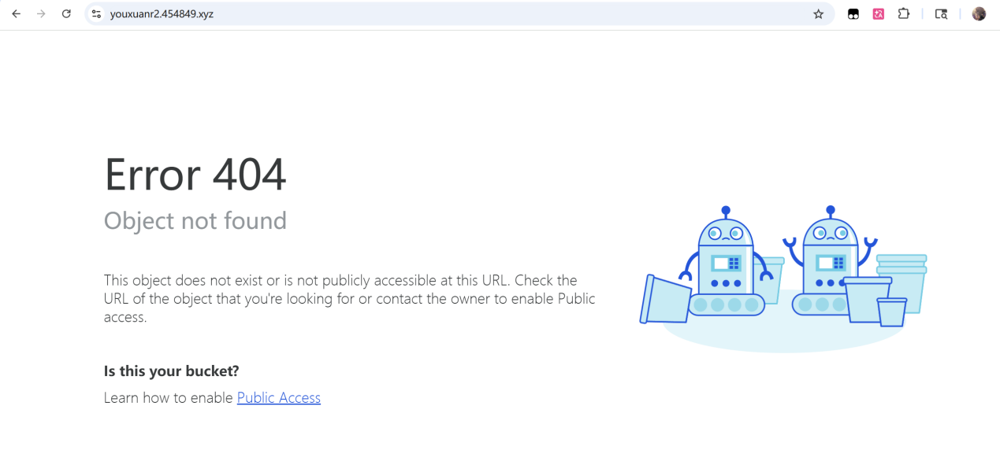

真正验证时，要访问一个确实存在的对象，或者用测速工具看域名解析和访问延迟。我这里 `youxuanr2.454849.xyz` 的测试结果也能正常跑出来。

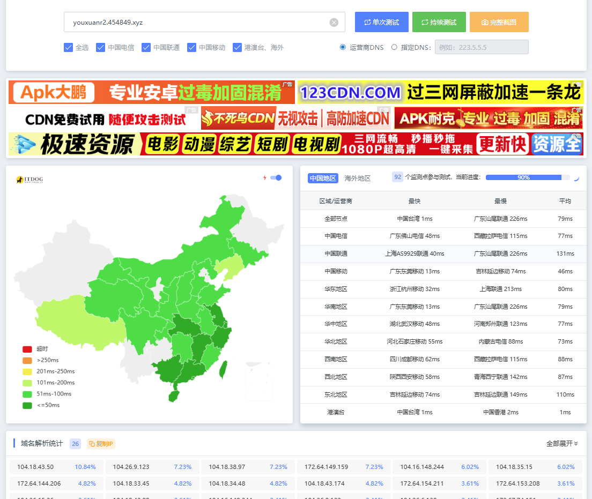

## 验证清单

做完以后我会按这个顺序检查：

1. DNS 里用户访问域名和中转域名都是 `CNAME`，并且保持“仅 DNS”。
2. SaaS 回退源处于有效状态，自定义主机名证书也验证完成。
3. 访问用户域名时，页面能打开到真正的 Tunnel、Worker 或 R2 对象。
4. 访问回源域名时，仍然能确认真实服务本身正常。
5. 用不同线路测一次，不要只看单个节点的延迟。

DNS 刚改完时可能会有缓存。Cloudflare 后台显示保存成功，不代表外部解析已经完全同步；证书验证也可能需要等一会儿。

## 限制和注意事项

这套方案依赖 Cloudflare 的 SaaS、自定义主机名、规则和 DNS 行为。Cloudflare 后台 UI 会变，功能入口也可能调整，所以具体按钮以当前控制台为准。

另外，优选入口本身是第三方能力时，要自己判断稳定性和可信度。它能改善某些线路的访问质量，但也多了一层依赖。个人项目拿来折腾没问题，重要业务最好准备回退方案。

最后，测试结果不要过度外推。我的环境里电信收益更明显，移动不一定救得回来，联通可能本来就够稳。对自己有用才算数。

## 参考资料

- <a href="https://developers.cloudflare.com/tunnel/routing/" target="_blank" rel="noopener noreferrer">Cloudflare Tunnel routing</a>
- <a href="https://developers.cloudflare.com/workers/configuration/routing/" target="_blank" rel="noopener noreferrer">Workers routes and domains</a>
- <a href="https://developers.cloudflare.com/workers/configuration/routing/routes/" target="_blank" rel="noopener noreferrer">Workers routes</a>
- <a href="https://developers.cloudflare.com/r2/data-access/public-buckets/" target="_blank" rel="noopener noreferrer">R2 public buckets and custom domains</a>
- <a href="https://developers.cloudflare.com/cloudflare-for-platforms/cloudflare-for-saas/start/getting-started/" target="_blank" rel="noopener noreferrer">Cloudflare for SaaS getting started</a>
- <a href="https://developers.cloudflare.com/workers/static-assets/migrate-from-pages/" target="_blank" rel="noopener noreferrer">Migrate from Pages to Workers</a>
