域名邮箱最实用的地方，是把不同网站、不同服务的注册邮箱隔离开来。比如给购物、订阅、测试项目、临时服务分别准备不同的邮箱地址，后续如果某个地址开始收到垃圾邮件，也更容易判断泄露来源并停用。

这篇记录的是我目前使用的一套轻量方案：用 Cloud Mail 搭建邮箱面板和收信逻辑，用 Resend 负责 SMTP 发信，再把 Gmail 作为可选的收发客户端。它不适合替代企业邮箱，但很适合作为个人域名邮箱、注册别名邮箱、项目测试邮箱来用。

> [!NOTE]
> 批量管理账号邮箱别名时，仍然要遵守对应网站的服务条款。有些平台会限制自定义域名邮箱，特别是免费域名、低价域名、新注册域名，可能会触发风控或直接不支持。

## 整体方案

这套方案可以拆成两条链路：

- 收信：外部服务发邮件到你的域名邮箱，Cloudflare / Cloud Mail 接收后，转发到 Cloud Mail 面板、Telegram 或 Gmail。
- 发信：Cloud Mail 或 Gmail 通过 Resend 的 SMTP 服务，以你的域名邮箱身份发出邮件。

需要准备：

- 一个已经接入 Cloudflare 的域名
- 一个 Cloudflare 账号
- 一个 GitHub 账号，用来部署 Cloud Mail
- 一个 Resend 账号，用来发信
- 一个 Gmail 账号，可选，用来当日常收发客户端

Cloud Mail 项目地址：[maillab/cloud-mail](https://github.com/maillab/cloud-mail)

Cloud Mail 官方部署文档：[界面部署](https://doc.skymail.ink/guide/dashboard.html)

## 先完成 Cloud Mail 收信

Cloud Mail 的基础部署建议直接按官方文档走。核心步骤是：

1. Fork 或克隆 Cloud Mail 项目到自己的 GitHub。
2. 在 Cloudflare Workers & Pages 里从 GitHub 导入项目。
3. 按文档配置环境变量、D1、KV 和自定义域。
4. 初始化数据库，注册管理员账号并登录 Cloud Mail 面板。
5. 在 Cloudflare 邮件路由里配置目标地址或 Workers，让邮件能进入 Cloud Mail。

做到这里，通常已经可以完成收信。但如果想从 Cloud Mail 或 Gmail 发出域名邮箱邮件，还需要继续配置 Resend。

## 配置 Resend 发信

打开 [Resend](https://resend.com/) 官网，注册并登录账号，然后进入 `Domains` 页面，点击 `Add domain` 添加自己的域名。

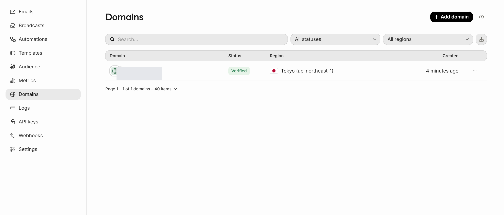

Resend 会要求你添加 DNS 记录来验证域名。按页面提示跳转到 Cloudflare，添加对应解析记录，等待状态变成 `Verified`。

> [!NOTE]
> 我这里直接添加主域名。如果你更在意发信信誉隔离，也可以用类似 `mail.example.com` 这样的子域名。

域名验证完成后，进入 `API keys` 页面，创建一个新的 API Key。这个 Key 只会完整显示一次，一定要立刻保存好。

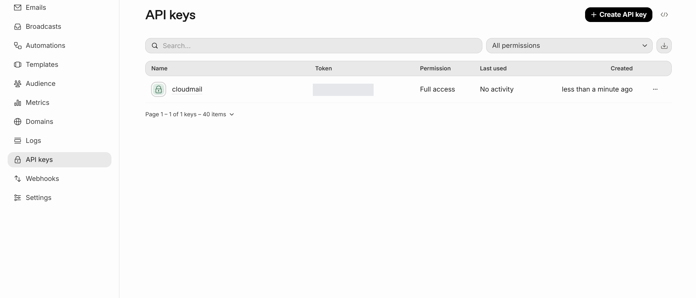

回到 Cloud Mail 的系统设置，找到 `Resend Token`，把刚才保存的 API Key 填进去并保存。

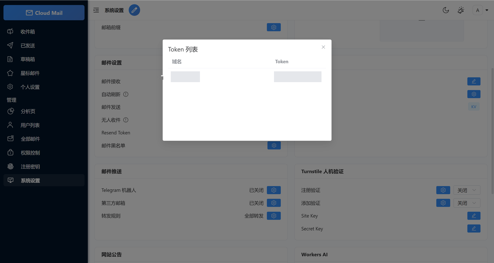

到这里，Cloud Mail 端的收信和发信能力就基本完成了。可以先在 Cloud Mail 面板里发一封测试邮件，确认外部邮箱能正常收到。

## 可选：把邮件转发到 Gmail

如果你希望继续用 Gmail 作为主收件箱，可以把 Cloud Mail 收到的邮件再转发到 Gmail。

先进入 Cloudflare 的邮件路由页面，在 `目标地址` 中添加自己的 Gmail 地址，并到 Gmail 收件箱里点击 Cloudflare 发来的验证链接。

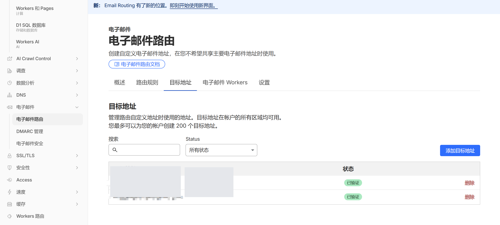

然后回到 Cloud Mail，进入系统设置里的 `邮件推送`，在 `第三方邮箱` 中填入刚刚验证过的 Gmail 地址，启用并保存。

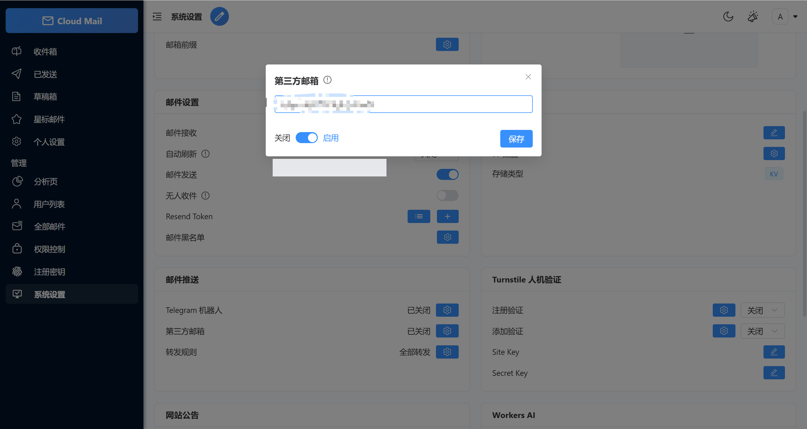

在下方的转发规则里，可以指定哪些域名邮箱需要转发到 Gmail。比如只把 `admin@你的域名` 转发过去，其它临时地址仍然留在 Cloud Mail 面板里。

## 可选：让 Gmail 代发域名邮箱

转发解决的是收信。如果还想直接在 Gmail 里选择域名邮箱作为发件地址，需要给 Gmail 添加 Resend 的 SMTP 信息。

在电脑浏览器打开 Gmail，点击右上角设置，选择 `查看所有设置`。

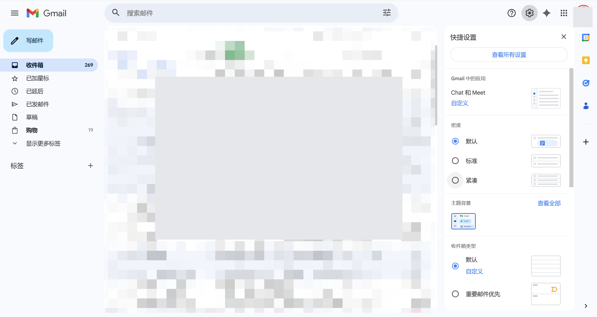

进入 `账号和导入`，在 `用这个地址发送邮件` 一栏里点击 `添加其他电子邮件地址`。

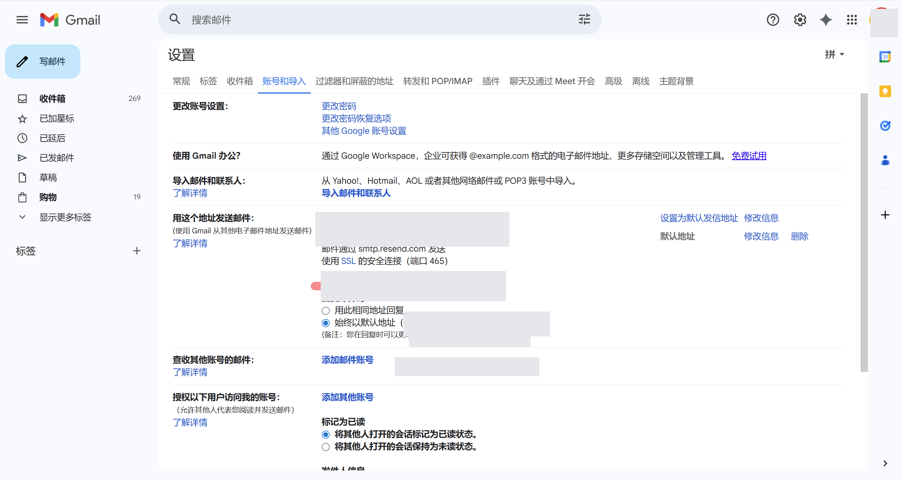

在弹出的窗口里填入你想显示的名称和域名邮箱地址。

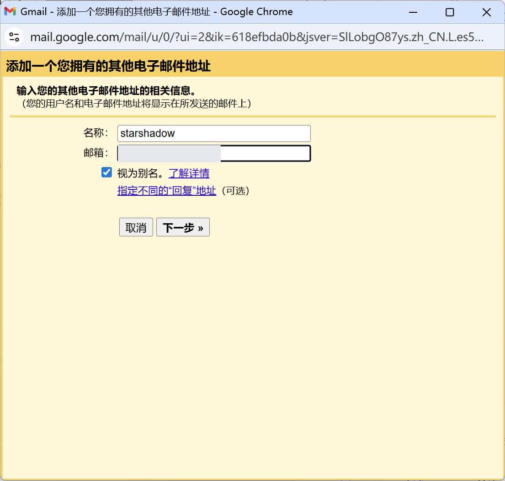

下一步会要求填写 SMTP 信息。Resend 的 SMTP 参数如下：

- SMTP 服务器：`smtp.resend.com`
- 端口：`465`
- 用户名：`resend`
- 密码：你的 Resend API Key
- 安全连接：选择 `SSL`

这些信息也可以在 Resend 的 `Settings -> SMTP` 页面找到。

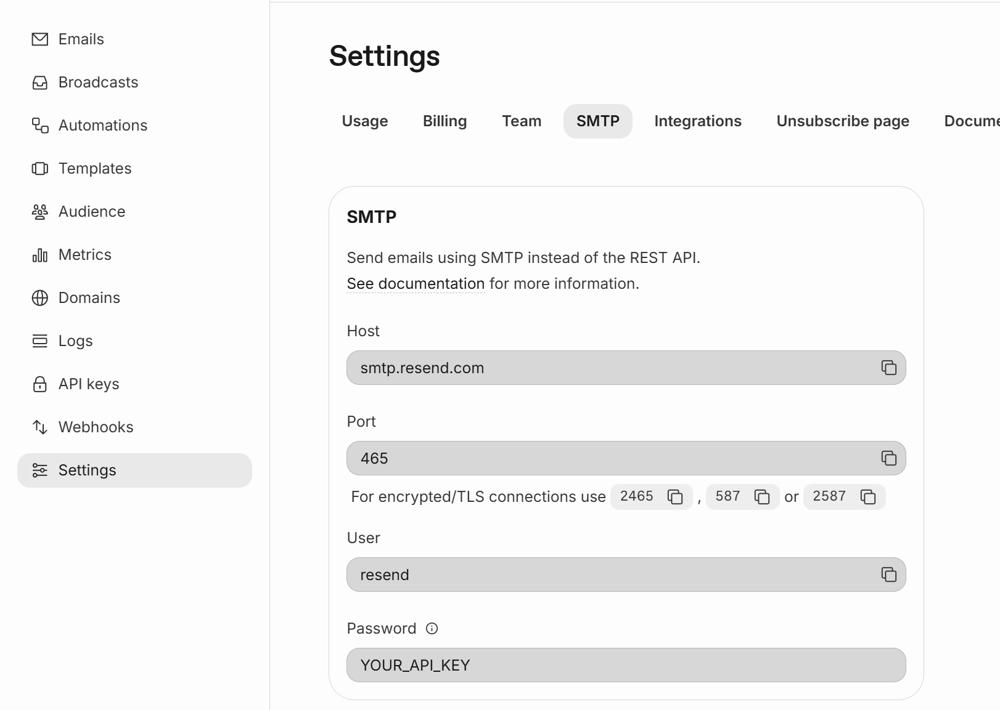

把 SMTP 信息填入 Gmail，点击 `添加账号`。

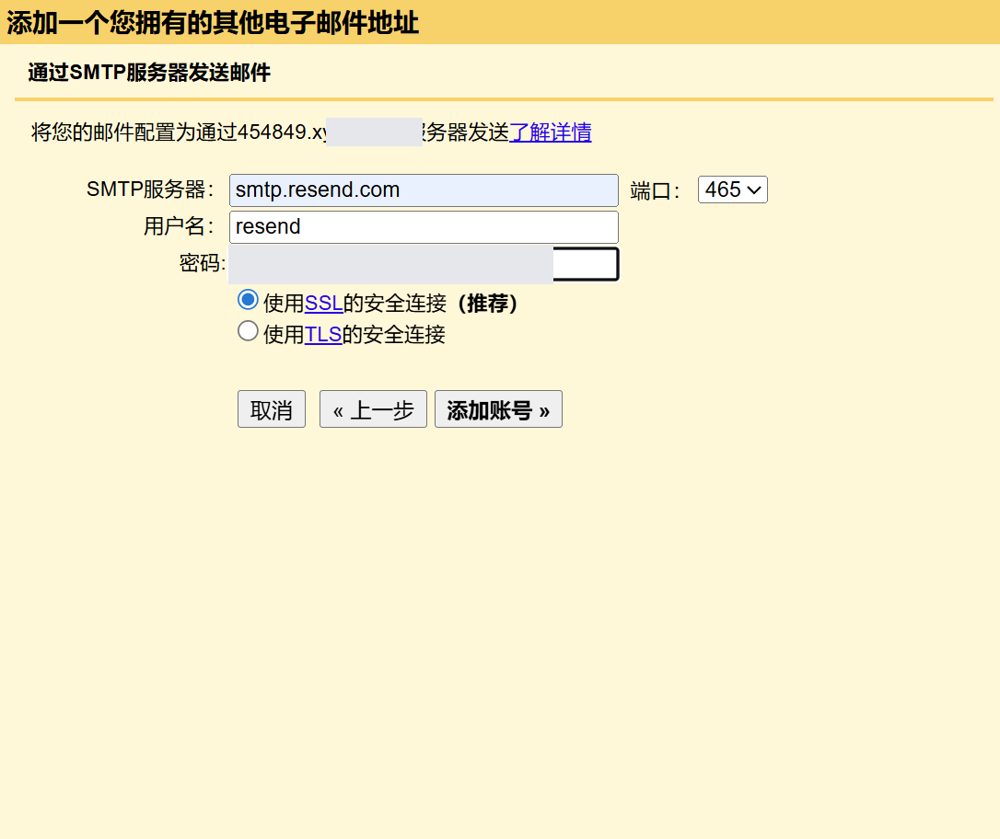

Gmail 会向这个域名邮箱发送一封确认邮件。你可以在 Cloud Mail 里复制确认链接，也可以等它转发到 Gmail 后直接点击链接完成验证。

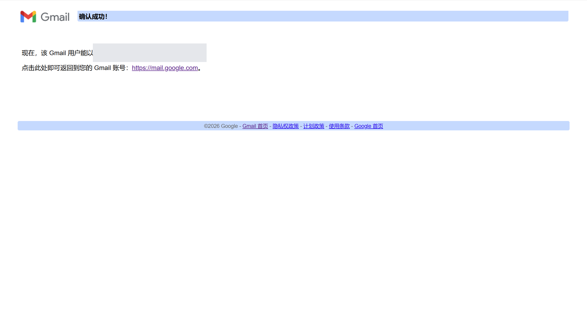

验证成功后，回到 Gmail 设置页，按 `F5` 刷新。然后把域名邮箱设置成默认发件地址。这样以后在 Gmail 写邮件时，就可以默认用域名邮箱发出。

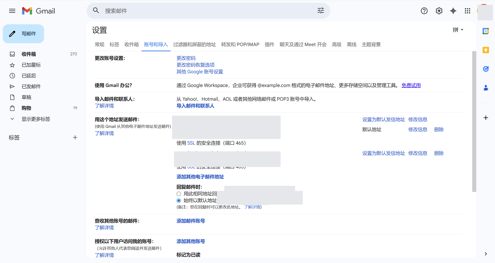

## 验证一下

配置完成后，我建议至少做三次测试：

1. 从外部邮箱发信到 `admin@你的域名`，确认 Cloud Mail 能收到。
2. 如果启用了转发，确认 Gmail 也能收到同一封邮件。
3. 从 Cloud Mail 或 Gmail 使用域名邮箱发信给外部邮箱，确认对方看到的发件人是你的域名邮箱。

如果 Gmail 迟迟收不到确认邮件，可以先检查 Cloud Mail 是否已经收到，再检查 Cloudflare 邮件路由的目标地址是否完成验证。

## 限制和注意事项

Resend 免费档适合个人低频使用。目前免费额度是 100 封/天、3000 封/月、1 个自定义域。如果你使用 Resend 的接收功能，收到的邮件也会计入额度；但这篇方案主要使用 Resend 发信。

Cloudflare Email Routing 本身只负责收信转发，不提供 SMTP 发信服务器。所以发信这部分必须借助 Resend 这样的第三方 SMTP 服务。

这套方案也不是“完全私密邮箱”。从信任模型上，你仍然要信任 Cloudflare、Cloud Mail 的部署环境，以及 Resend 的发信服务。普通注册、通知、项目测试没有太大问题，但高度敏感的邮件不建议放在这类免费组合方案里。

最后，域名邮箱不一定能通过所有平台的验证。以 OpenAI 这类风控更严格的服务为例，免费域名、低价域名、新注册域名或信誉较弱的自定义域名邮箱，都可能被拒绝。

## 参考资料

- [Cloud Mail 官方文档](https://doc.skymail.ink/guide/dashboard.html)
- [Resend 价格与免费额度](https://resend.com/pricing)
- [Resend SMTP 文档](https://resend.com/docs/send-with-smtp)
- [Resend 账号额度说明](https://resend.com/docs/knowledge-base/account-quotas-and-limits)
- [Cloudflare Email Routing 文档](https://developers.cloudflare.com/email-routing/)
- [Gmail：使用其他地址发信](https://support.google.com/mail/answer/22370)
